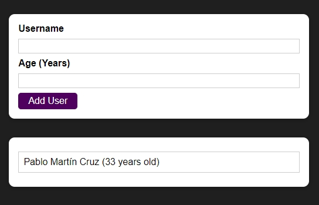

# User Register App :frowning_man:

## Lessons Learned

- Styling React Components (CSS Modules)
- React Fragments
- React DOM Portals  

## Demo

[**Project**](https://user-register-react.netlify.app/) created in a Udemy course of [React.js](https://www.udemy.com/course/react-the-complete-guide-incl-redux/)
  
## Screenshot



  
## Run Locally

Clone the project

```bash
  git clone https://github.com/Pablo-MC/user-register.git
```

Install dependencies

```bash
  npm install
```

Start the server

```bash
  npm start
```